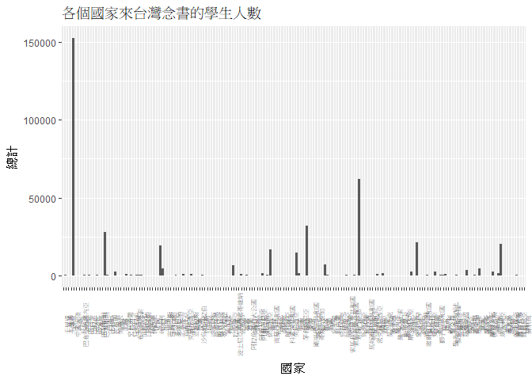
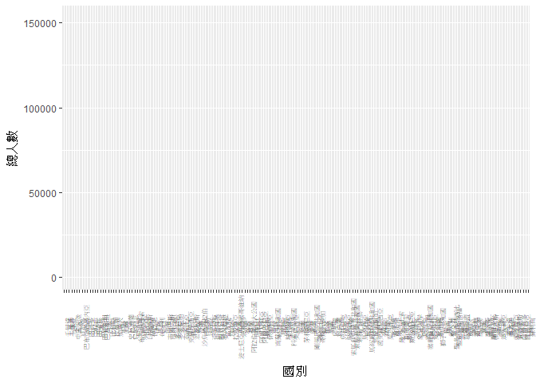

106-2 大數據分析方法 作業二
================
連昱棋

作業完整說明[連結](https://docs.google.com/document/d/1aLGSsGXhgOVgwzSg9JdaNz2qGPQJSoupDAQownkGf_I/edit?usp=sharing)

學習再也不限定在自己出生的國家，台灣每年有許多學生選擇就讀國外的大專院校，同時也有人多國外的學生來台灣就讀，透過分析[大專校院境外學生人數統計(我國大學有多少境外生)](https://data.gov.tw/dataset/6289)、[大專校院本國學生出國進修交流數](https://data.gov.tw/dataset/24730)、[世界各主要國家之我國留學生人數統計表](https://ws.moe.edu.tw/Download.ashx?u=C099358C81D4876CC7586B178A6BD6D5062C39FB76BDE7EC7685C1A3C0846BCDD2B4F4C2FE907C3E7E96F97D24487065577A728C59D4D9A4ECDFF432EA5A114C8B01E4AFECC637696DE4DAECA03BB417&n=4E402A02CE6F0B6C1B3C7E89FDA1FAD0B5DDFA6F3DA74E2DA06AE927F09433CFBC07A1910C169A1845D8EB78BD7D60D7414F74617F2A6B71DC86D17C9DA3781394EF5794EEA7363C&icon=..csv)可以了解103年以後各大專院校國際交流的情形。請同學分析以下議題，並以視覺化的方式呈現分析結果，呈現103年以後大專院校國際交流的情形。

來台境外生分析
--------------

### 資料匯入與處理

``` r
options(allow_html_in_all_outputs=TRUE)
library(readr)
```

    ## Warning: package 'readr' was built under R version 3.4.4

``` r
library(dplyr)
```

    ## 
    ## Attaching package: 'dplyr'

    ## The following objects are masked from 'package:stats':
    ## 
    ##     filter, lag

    ## The following objects are masked from 'package:base':
    ## 
    ##     intersect, setdiff, setequal, union

``` r
library(ggplot2)
```

    ## Warning: package 'ggplot2' was built under R version 3.4.4

``` r
library(choroplethrMaps)
```

    ## Warning: package 'choroplethrMaps' was built under R version 3.4.4

``` r
library(choroplethr)
```

    ## Warning: package 'choroplethr' was built under R version 3.4.4

    ## Loading required package: acs

    ## Warning: package 'acs' was built under R version 3.4.4

    ## Loading required package: stringr

    ## Warning: package 'stringr' was built under R version 3.4.4

    ## Loading required package: XML

    ## 
    ## Attaching package: 'acs'

    ## The following object is masked from 'package:dplyr':
    ## 
    ##     combine

    ## The following object is masked from 'package:base':
    ## 
    ##     apply

``` r
library(ggmap)
```

    ## Warning: package 'ggmap' was built under R version 3.4.4

``` r
library(maps)
```

    ## Warning: package 'maps' was built under R version 3.4.4

``` r
library(rgdal)
```

    ## Warning: package 'rgdal' was built under R version 3.4.4

    ## Loading required package: sp

    ## Warning: package 'sp' was built under R version 3.4.4

    ## rgdal: version: 1.2-20, (SVN revision 725)
    ##  Geospatial Data Abstraction Library extensions to R successfully loaded
    ##  Loaded GDAL runtime: GDAL 2.2.3, released 2017/11/20
    ##  Path to GDAL shared files: C:/Users/hh770/Documents/R/R-3.4.3/library/sf/gdal
    ##  GDAL binary built with GEOS: TRUE 
    ##  Loaded PROJ.4 runtime: Rel. 4.9.3, 15 August 2016, [PJ_VERSION: 493]
    ##  Path to PROJ.4 shared files: C:/Users/hh770/Documents/R/R-3.4.3/library/sf/proj
    ##  Linking to sp version: 1.2-7

``` r
library(rgeos) 
```

    ## Warning: package 'rgeos' was built under R version 3.4.4

    ## rgeos version: 0.3-26, (SVN revision 560)
    ##  GEOS runtime version: 3.6.1-CAPI-1.10.1 r0 
    ##  Linking to sp version: 1.2-7 
    ##  Polygon checking: TRUE

``` r
library(maptools)
```

    ## Warning: package 'maptools' was built under R version 3.4.4

    ## Checking rgeos availability: TRUE

``` r
library(plotly)
```

    ## Warning: package 'plotly' was built under R version 3.4.4

    ## 
    ## Attaching package: 'plotly'

    ## The following object is masked from 'package:ggmap':
    ## 
    ##     wind

    ## The following object is masked from 'package:ggplot2':
    ## 
    ##     last_plot

    ## The following object is masked from 'package:stats':
    ## 
    ##     filter

    ## The following object is masked from 'package:graphics':
    ## 
    ##     layout

``` r
library(knitr)
```

    ## Warning: package 'knitr' was built under R version 3.4.4

``` r
library(jsonlite)
```

    ## Warning: package 'jsonlite' was built under R version 3.4.4

``` r
#匯入境外生來台資料(國別)(第一題)
Data103<- read_csv("C:/Users/hh770/Downloads/25f64d5125016dcd6aed42e50c972ed0_export.csv")
```

    ## Parsed with column specification:
    ## cols(
    ##   洲別 = col_character(),
    ##   國別 = col_character(),
    ##   `學位生-正式修讀學位外國生` = col_integer(),
    ##   `學位生-僑生(含港澳)` = col_integer(),
    ##   `學位生-正式修讀學位陸生` = col_integer(),
    ##   `非學位生-外國交換生` = col_integer(),
    ##   `非學位生-外國短期研習及個人選讀` = col_integer(),
    ##   `非學位生-大專附設華語文中心學生` = col_integer(),
    ##   `非學位生-大陸研修生` = col_integer(),
    ##   `非學位生-海青班` = col_integer(),
    ##   境外專班 = col_integer()
    ## )

``` r
Data104<- read_csv("C:/Users/hh770/Downloads/104_ab104_C.csv")
```

    ## Parsed with column specification:
    ## cols(
    ##   洲別 = col_character(),
    ##   國別 = col_character(),
    ##   `學位生-正式修讀學位外國生` = col_integer(),
    ##   `學位生-僑生(含港澳)` = col_integer(),
    ##   `學位生-正式修讀學位陸生` = col_integer(),
    ##   `非學位生-外國交換生` = col_integer(),
    ##   `非學位生-外國短期研習及個人選讀` = col_integer(),
    ##   `非學位生-大專附設華語文中心學生` = col_integer(),
    ##   `非學位生-大陸研修生` = col_integer(),
    ##   `非學位生-海青班` = col_integer(),
    ##   境外專班 = col_integer()
    ## )

``` r
Data105<- read_csv("C:/Users/hh770/Downloads/105_ab105_C.csv")
```

    ## Parsed with column specification:
    ## cols(
    ##   洲別 = col_character(),
    ##   國別 = col_character(),
    ##   學位生_正式修讀學位外國生 = col_integer(),
    ##   `學位生_僑生(含港澳)` = col_integer(),
    ##   學位生_正式修讀學位陸生 = col_integer(),
    ##   非學位生_外國交換生 = col_integer(),
    ##   非學位生_外國短期研習及個人選讀 = col_integer(),
    ##   非學位生_大專附設華語文中心學生 = col_integer(),
    ##   非學位生_大陸研修生 = col_integer(),
    ##   非學位生_海青班 = col_integer(),
    ##   境外專班 = col_integer()
    ## )

``` r
Data106<- read_csv("C:/Users/hh770/Downloads/106_ab105_C.csv")
```

    ## Parsed with column specification:
    ## cols(
    ##   洲別 = col_character(),
    ##   國別 = col_character(),
    ##   學位生_正式修讀學位外國生 = col_integer(),
    ##   `學位生_僑生(含港澳)` = col_integer(),
    ##   學位生_正式修讀學位陸生 = col_integer(),
    ##   非學位生_外國交換生 = col_integer(),
    ##   非學位生_外國短期研習及個人選讀 = col_integer(),
    ##   非學位生_大專附設華語文中心學生 = col_integer(),
    ##   非學位生_大陸研修生 = col_integer(),
    ##   非學位生_海青班 = col_integer(),
    ##   境外專班 = col_integer()
    ## )

``` r
#匯入境外生來台資料(校別)(第一題)
Data103a<-read_csv("C:/Users/hh770/Downloads/103_ab103_S.csv")
```

    ## Parsed with column specification:
    ## cols(
    ##   學校類型 = col_character(),
    ##   學校代碼 = col_character(),
    ##   學校名稱 = col_character(),
    ##   `學位生-正式修讀學位外國生` = col_integer(),
    ##   `學位生-僑生(含港澳)` = col_integer(),
    ##   `學位生-正式修讀學位陸生` = col_integer(),
    ##   `非學位生-外國交換生` = col_integer(),
    ##   `非學位生-外國短期研習及個人選讀` = col_integer(),
    ##   `非學位生-大專附設華語文中心學生` = col_integer(),
    ##   `非學位生-大陸研修生` = col_character(),
    ##   `非學位生-海青班` = col_integer(),
    ##   境外專班 = col_integer()
    ## )

``` r
Data104a<-read_csv("C:/Users/hh770/Downloads/104_ab104_S.csv")
```

    ## Parsed with column specification:
    ## cols(
    ##   學校類型 = col_character(),
    ##   學校代碼 = col_character(),
    ##   學校名稱 = col_character(),
    ##   `學位生-正式修讀學位外國生` = col_integer(),
    ##   `學位生-僑生(含港澳)` = col_integer(),
    ##   `學位生-正式修讀學位陸生` = col_integer(),
    ##   `非學位生-外國交換生` = col_integer(),
    ##   `非學位生-外國短期研習及個人選讀` = col_integer(),
    ##   `非學位生-大專附設華語文中心學生` = col_integer(),
    ##   `非學位生-大陸研修生` = col_character(),
    ##   `非學位生-海青班` = col_integer(),
    ##   境外專班 = col_integer()
    ## )

``` r
Data105a<-read_csv("C:/Users/hh770/Downloads/105_ab105_S.csv")
```

    ## Parsed with column specification:
    ## cols(
    ##   學校類型 = col_character(),
    ##   學校代碼 = col_character(),
    ##   學校名稱 = col_character(),
    ##   學位生_正式修讀學位外國生 = col_integer(),
    ##   `學位生_僑生(含港澳)` = col_integer(),
    ##   學位生_正式修讀學位陸生 = col_integer(),
    ##   非學位生_外國交換生 = col_integer(),
    ##   非學位生_外國短期研習及個人選讀 = col_integer(),
    ##   非學位生_大專附設華語文中心學生 = col_integer(),
    ##   非學位生_大陸研修生 = col_integer(),
    ##   非學位生_海青班 = col_integer(),
    ##   境外專班 = col_integer()
    ## )

``` r
Data106a<-read_csv("C:/Users/hh770/Downloads/106_ab105_S.csv")
```

    ## Parsed with column specification:
    ## cols(
    ##   學校類型 = col_character(),
    ##   學校代碼 = col_character(),
    ##   學校名稱 = col_character(),
    ##   學位生_正式修讀學位外國生 = col_integer(),
    ##   `學位生_僑生(含港澳)` = col_integer(),
    ##   學位生_正式修讀學位陸生 = col_integer(),
    ##   非學位生_外國交換生 = col_integer(),
    ##   非學位生_外國短期研習及個人選讀 = col_integer(),
    ##   非學位生_大專附設華語文中心學生 = col_integer(),
    ##   非學位生_大陸研修生 = col_integer(),
    ##   非學位生_海青班 = col_integer(),
    ##   境外專班 = col_integer()
    ## )

``` r
#匯入大專校院本國學生出國進修交流數(第四題)
Student_RPT<- read.csv("C:/Users/hh770/Downloads/Student_RPT_07 .csv")
```

### 哪些國家來台灣唸書的學生最多呢？

``` r
#這是R Code Chunk

#(第一題第一小題)哪些國家來台灣唸書的學生最多呢？請取出前十名的國家與總人數，由大到小排序
#加總各國境外生總人數(第一題)
Data103$ForeignStudentSum103<-0
for (n in 1:149) {
  Data103[n,12]<-sum(Data103[n,3:11])
}
Data104$ForeignStudentSum104<-0
for (n in 1:159) {
  Data104[n,12]<-sum(Data104[n,3:11])
}
Data105$ForeignStudentSum105<-0
for (n in 1:165) {
  Data105[n,12]<-sum(Data105[n,3:11])
}
Data106$ForeignStudentSum106<-0
for (n in 1:167) {
  Data106[n,12]<-sum(Data106[n,3:11])
}
#以國家為基準結合四個年度的境外生人數(第一題)
CountryBaseSum103<-Data103[,c("國別","ForeignStudentSum103")]
CountryBaseSum104<-Data104[,c("國別","ForeignStudentSum104")]
CountryBaseSum105<-Data105[,c("國別","ForeignStudentSum105")]
CountryBaseSum106<-Data106[,c("國別","ForeignStudentSum106")]
CountryBaseSum<-merge(CountryBaseSum103,CountryBaseSum104,by="國別",all=T)
CountryBaseSum<-merge(CountryBaseSum,CountryBaseSum105,by="國別",all=T)  
CountryBaseSum<-merge(CountryBaseSum,CountryBaseSum106,by="國別",all=T)
#加總四個年度資料
CountryBaseSum$CountrySum<-0
for (n in 1:177) {
  CountryBaseSum[n,6]<-sum(CountryBaseSum[n,2:5],na.rm = T)
}
knitr::kable(head(arrange(CountryBaseSum,desc(CountrySum)),10))
```

    ## Warning: package 'bindrcpp' was built under R version 3.4.4

| 國別     |  ForeignStudentSum103|  ForeignStudentSum104|  ForeignStudentSum105|  ForeignStudentSum106|  CountrySum|
|:---------|---------------------:|---------------------:|---------------------:|---------------------:|-----------:|
| 中國大陸 |                 33288|                 41951|                 41981|                 35304|      152524|
| 馬來西亞 |                 13385|                 15054|                 16311|                 17281|       62031|
| 香港     |                  6286|                  8233|                  8660|                  8761|       31940|
| 日本     |                  5816|                  6455|                  7542|                  8387|       28200|
| 越南     |                  4005|                  4459|                  5342|                  7864|       21670|
| 澳門     |                  4723|                  5152|                  5286|                  5141|       20302|
| 印尼     |                  3559|                  4454|                  5154|                  6453|       19620|
| 南韓     |                  3587|                  4062|                  4575|                  4724|       16948|
| 美國     |                  3328|                  4003|                  3701|                  3814|       14846|
| 泰國     |                  1535|                  1591|                  1771|                  2138|        7035|

### 哪間大學的境外生最多呢？

``` r
#這是R Code Chunk
#處理不正常的值
Data103a$`非學位生-大陸研修生`<-gsub("…",NA,Data103a$`非學位生-大陸研修生`)
Data104a$`非學位生-大陸研修生`<-gsub("…",NA,Data104a$`非學位生-大陸研修生`)
#分別加總每年境外生人數
Data103a$SchoolForeignStudentSum103<-0
for (n in 1:153) {
  Data103a[n,13]<-sum(Data103a[n,4:9],na.rm = T)
}
Data104a$SchoolForeignStudentSum104<-0
Data104a$`非學位生-大陸研修生`<-as.numeric(Data104a$`非學位生-大陸研修生`)
for (n in 1:154) {
  Data104a[n,13]<-sum(Data104a[n,4:10],na.rm = T)
}
Data105a$SchoolForeignStudentSum105<-0
for (n in 1:154) {
  Data105a[n,13]<-sum(Data105a[n,4:10],na.rm = T)
} 
Data106a$SchoolForeignStudentSum106<-0
for (n in 1:154) {
  Data106a[n,13]<-sum(Data106a[n,4:10],na.rm = T)
}
 
#以學校為基準結合四個年度的境外生人數
SchoolBaseSum103<-Data103a[,c("學校名稱","SchoolForeignStudentSum103")]
SchoolBaseSum104<-Data104a[,c("學校名稱","SchoolForeignStudentSum104")]
SchoolBaseSum105<-Data105a[,c("學校名稱","SchoolForeignStudentSum105")]
SchoolBaseSum106<-Data106a[,c("學校名稱","SchoolForeignStudentSum106")]
SchoolBaseSum<-merge(SchoolBaseSum103,SchoolBaseSum104,by="學校名稱",all=T)
SchoolBaseSum<-merge(SchoolBaseSum,SchoolBaseSum105,by="學校名稱",all=T)
SchoolBaseSum<-merge(SchoolBaseSum,SchoolBaseSum106,by="學校名稱",all=T)
#加總四個年度資料
SchoolBaseSum$SchoolSum<-0
for(n in 1:177){
  SchoolBaseSum[n,6]<-sum(SchoolBaseSum[n,2:5],na.rm = T)
}
knitr::kable(head(arrange(SchoolBaseSum,desc(SchoolSum)),10))
```

| 學校名稱         |  SchoolForeignStudentSum103|  SchoolForeignStudentSum104|  SchoolForeignStudentSum105|  SchoolForeignStudentSum106|  SchoolSum|
|:-----------------|---------------------------:|---------------------------:|---------------------------:|---------------------------:|----------:|
| 無法區分校別     |                          NA|                       34114|                       32648|                       25824|      92586|
| 國立臺灣師範大學 |                        4648|                        5328|                        5709|                        6428|      22113|
| 國立臺灣大學     |                        3800|                        4514|                        4817|                        5068|      18199|
| 中國文化大學     |                        3878|                        3958|                        3820|                        3479|      15135|
| 銘傳大學         |                        3026|                        3682|                        3723|                        3795|      14226|
| 淡江大學         |                        2986|                        3254|                        3727|                        3920|      13887|
| 國立政治大學     |                        2705|                        2871|                        2989|                        3061|      11626|
| 國立成功大學     |                        2385|                        2554|                        2864|                        3179|      10982|
| 輔仁大學         |                        2276|                        2271|                        2518|                        2434|       9499|
| 逢甲大學         |                        1679|                        2154|                        2148|                        2244|       8225|

### 各個國家來台灣唸書的學生人數條狀圖

``` r
#這是R Code Chunk
#(第二題)用bar chart呈現各個國家(全部)來台灣唸書的學生人數
ggplot(CountryBaseSum,
       aes(x=國別,y=CountrySum))+
  geom_bar(stat = "identity")+
  labs(x="國家",y="總計",title="各個國家來台灣念書的學生人數")+
  theme(axis.text.x = element_text(size = 6,angle = 90))+
  theme(panel.border = element_blank())
```



### 各個國家來台灣唸書的學生人數面量圖

``` r
#這是R Code Chunk
#(第三題)用面量圖呈現各個國家來台灣唸書的學生人數，人數越多顏色越深

#把國家名字換成英文
CountryName<-fromJSON("C:/Users/hh770/Downloads/countries.json")
CountryBaseSum$country<-""
for (n in 1:177) {
  for (m in 1:250) {
     if(CountryBaseSum[n,1]==CountryName$Taiwan[m])
   CountryBaseSum[n,7]<-CountryName$ISO3[m]
   }
}
#手動輸入
CountryBaseSum[5,7]<-"CHN"
CountryBaseSum[8,7]<-"PNG"
CountryBaseSum[42,7]<-"TUV"
CountryBaseSum[48,7]<-"HRV"
CountryBaseSum[50,7]<-"HND"
CountryBaseSum[67,7]<-"BIH"
CountryBaseSum[72,7]<-"SAU"
CountryBaseSum[80,7]<-"KOR"
CountryBaseSum[81,7]<-"SSD"
CountryBaseSum[87,7]<-"KOS"
CountryBaseSum[96,7]<-"COD"
CountryBaseSum[108,7]<-"NAM"
CountryBaseSum[112,7]<-"SLB"
CountryBaseSum[117,7]<-"MHL"
CountryBaseSum[119,7]<-"MLT"
CountryBaseSum[120,7]<-"FSM"
CountryBaseSum[139,7]<-"SRB"
CountryBaseSum[143,7]<-"SGP"
CountryBaseSum[144,7]<-"SLE"
CountryBaseSum[148,7]<-"VCT"
CountryBaseSum[150,7]<-"KNA"
CountryBaseSum[153,7]<-"COM"
CountryBaseSum[167,7]<-"AUS"
CountryBaseSum[173,7]<-"CYP"
#用PLOT畫圖
l <- list(color = toRGB("grey"), width = 0.8)
g <- list(
  showframe=FALSE,
  showcountries=TRUE,
  showcoastlines=TRUE,
  coastlinecolor=toRGB("grey"),
  countrycolor=toRGB("grey"))
plot_ly(CountryBaseSum, 
        z=~CountrySum, 
        text=~country, 
        locations=~country, 
        type= 'choropleth',
        color=~CountrySum, 
        colors='Greens', 
        marker = list(line = l)) %>%
  layout(title='各個國家來台灣唸書的學生人數', geo=g)
```

<!--html_preserve-->

<script type="application/json" data-for="588a835f6c">{"x":{"visdat":{"588af6c63":["function () ","plotlyVisDat"]},"cur_data":"588af6c63","attrs":{"588af6c63":{"z":{},"text":{},"locations":{},"marker":{"line":{"color":"rgba(190,190,190,1)","width":0.8}},"color":{},"colors":"Greens","alpha":1,"sizes":[10,100],"type":"choropleth"}},"layout":{"margin":{"b":40,"l":60,"t":25,"r":10},"title":"各個國家來台灣唸書的學生人數","geo":{"showframe":false,"showcountries":true,"showcoastlines":true,"coastlinecolor":"rgba(190,190,190,1)","countrycolor":"rgba(190,190,190,1)"},"scene":{"zaxis":{"title":"CountrySum"}},"xaxis":{"domain":[0,1]},"yaxis":{"domain":[0,1]},"hovermode":"closest","showlegend":false,"legend":{"y":0.5,"yanchor":"top"}},"source":"A","config":{"modeBarButtonsToAdd":[{"name":"Collaborate","icon":{"width":1000,"ascent":500,"descent":-50,"path":"M487 375c7-10 9-23 5-36l-79-259c-3-12-11-23-22-31-11-8-22-12-35-12l-263 0c-15 0-29 5-43 15-13 10-23 23-28 37-5 13-5 25-1 37 0 0 0 3 1 7 1 5 1 8 1 11 0 2 0 4-1 6 0 3-1 5-1 6 1 2 2 4 3 6 1 2 2 4 4 6 2 3 4 5 5 7 5 7 9 16 13 26 4 10 7 19 9 26 0 2 0 5 0 9-1 4-1 6 0 8 0 2 2 5 4 8 3 3 5 5 5 7 4 6 8 15 12 26 4 11 7 19 7 26 1 1 0 4 0 9-1 4-1 7 0 8 1 2 3 5 6 8 4 4 6 6 6 7 4 5 8 13 13 24 4 11 7 20 7 28 1 1 0 4 0 7-1 3-1 6-1 7 0 2 1 4 3 6 1 1 3 4 5 6 2 3 3 5 5 6 1 2 3 5 4 9 2 3 3 7 5 10 1 3 2 6 4 10 2 4 4 7 6 9 2 3 4 5 7 7 3 2 7 3 11 3 3 0 8 0 13-1l0-1c7 2 12 2 14 2l218 0c14 0 25-5 32-16 8-10 10-23 6-37l-79-259c-7-22-13-37-20-43-7-7-19-10-37-10l-248 0c-5 0-9-2-11-5-2-3-2-7 0-12 4-13 18-20 41-20l264 0c5 0 10 2 16 5 5 3 8 6 10 11l85 282c2 5 2 10 2 17 7-3 13-7 17-13z m-304 0c-1-3-1-5 0-7 1-1 3-2 6-2l174 0c2 0 4 1 7 2 2 2 4 4 5 7l6 18c0 3 0 5-1 7-1 1-3 2-6 2l-173 0c-3 0-5-1-8-2-2-2-4-4-4-7z m-24-73c-1-3-1-5 0-7 2-2 3-2 6-2l174 0c2 0 5 0 7 2 3 2 4 4 5 7l6 18c1 2 0 5-1 6-1 2-3 3-5 3l-174 0c-3 0-5-1-7-3-3-1-4-4-5-6z"},"click":"function(gd) { \n        // is this being viewed in RStudio?\n        if (location.search == '?viewer_pane=1') {\n          alert('To learn about plotly for collaboration, visit:\\n https://cpsievert.github.io/plotly_book/plot-ly-for-collaboration.html');\n        } else {\n          window.open('https://cpsievert.github.io/plotly_book/plot-ly-for-collaboration.html', '_blank');\n        }\n      }"}],"cloud":false},"data":[{"colorbar":{"title":"CountrySum","ticklen":2,"len":0.5,"y":1,"lenmode":"fraction","yanchor":"top"},"colorscale":[["0","rgba(247,252,245,1)"],["1.96691646505773e-05","rgba(247,252,245,1)"],["2.62255528674364e-05","rgba(247,252,245,1)"],["3.27819410842955e-05","rgba(247,252,245,1)"],["4.58947175180137e-05","rgba(247,252,245,1)"],["5.90074939517319e-05","rgba(247,252,245,1)"],["7.86766586023092e-05","rgba(247,252,245,1)"],["0.000104902211469746","rgba(247,252,245,1)"],["0.000163909705421477","rgba(247,252,245,1)"],["0.000270997379630176","rgba(247,252,245,1)"],["0.000332190336320861","rgba(247,252,245,1)"],["0.000452390786963278","rgba(247,252,245,1)"],["0.000753984644938796","rgba(247,252,245,1)"],["0.00108617498125966","rgba(247,252,245,1)"],["0.00131783403158868","rgba(247,252,245,1)"],["0.00164565344243163","rgba(247,252,245,1)"],["0.0022379138446879","rgba(247,252,245,1)"],["0.00352078047245333","rgba(246,252,244,1)"],["0.00431628890943224","rgba(246,252,244,1)"],["0.00559478461171976","rgba(246,252,244,1)"],["0.00910682323321729","rgba(246,251,243,1)"],["0.018377556171856","rgba(244,251,242,1)"],["0.106517268433832","rgba(232,246,227,1)"],["1","rgba(0,68,27,1)"]],"showscale":true,"z":[7,655,13,50,152524,283,309,63,864,7,733,8,7,685,17,202,28200,640,7,199,2742,6,1,4,1152,1,640,236,572,547,672,72,122,68,251,10,294,19620,4845,288,43,176,5,407,10,381,1390,70,4,1105,49,122,17,756,11,32,16,5,29,115,69,74,13,185,45,6558,14,10,910,90,408,14,249,1,13,4,1593,51,656,16948,5,63,12,43,52,6,6,28,230,14846,1713,1,4,31940,26,6,245,84,118,176,7035,538,22,289,15,46,254,9,468,2,6,417,1,62031,11,142,173,4,5,1,1037,9,1512,20,20,1,2,1,16,140,248,80,148,2708,22,21670,31,9,22,729,42,192,2928,5,541,883,1186,359,211,267,442,27,1,195,3843,11,4,835,62,4535,69,6,3,20,2522,10,1758,20302,8,29,99,4,3,666,154,11,2],"text":["","TUR","TKM","BTN","CHN","DNK","ECU","PNG","BRA","BRB","PRY","BHR","BHS","PAN","PSE","PAK","JPN","BEL","JAM","ISR","CAN","GAB","PRK","CUB","SWZ","NER","NIC","NPL","BFA","GTM","GMB","BLR","LTU","IRQ","IRN","ISL","HUN","IDN","IND","KIR","KGZ","TUV","DMA","DOM","TGO","ETH","ESP","HRV","LBY","HND","GRC","BRN","SAU","BLZ","BEN","ZWE","ARM","AZE","TZA","NGA","VEN","BGD","ZMB","PLW","LVA","FRA","BIH","BWA","POL","KEN","FIN","SAU","ARG","OMN","DZA","ALB","RUS","BGR","ZAF","KOR","SSD","KAZ","TCD","KHM","BOL","KWT","KOS","TUN","JOR","USA","GBR","MRT","GHA","HKG","COG","COD","COL","CRI","EGY","NOR","THA","HTI","UGA","UKR","URY","UZB","PER","NAM","NZL","","","SLB","MLI","MYS","MKD","MWI","MHL","MDG","MLT","FSM","CZE","SYR","NLD","MOZ","CMR","GEO","GIN","GNB","FJI","LKA","SVK","SVN","CHL","PHL","CIV","VNM","TJK","SEN","SRB","AUT","EST","IRL","SGP","SLE","CHE","SWE","ITA","VCT","STP","KNA","LCA","YEM","COM","PRT","MNG","BDI","GUY","MEX","LAO","DEU","MAR","MCO","MDA","MUS","MMR","LBN","AUS","MAC","RWA","LUX","NRU","LBR","CYP","SLV","ROU","SDN","SUR"],"locations":["","TUR","TKM","BTN","CHN","DNK","ECU","PNG","BRA","BRB","PRY","BHR","BHS","PAN","PSE","PAK","JPN","BEL","JAM","ISR","CAN","GAB","PRK","CUB","SWZ","NER","NIC","NPL","BFA","GTM","GMB","BLR","LTU","IRQ","IRN","ISL","HUN","IDN","IND","KIR","KGZ","TUV","DMA","DOM","TGO","ETH","ESP","HRV","LBY","HND","GRC","BRN","SAU","BLZ","BEN","ZWE","ARM","AZE","TZA","NGA","VEN","BGD","ZMB","PLW","LVA","FRA","BIH","BWA","POL","KEN","FIN","SAU","ARG","OMN","DZA","ALB","RUS","BGR","ZAF","KOR","SSD","KAZ","TCD","KHM","BOL","KWT","KOS","TUN","JOR","USA","GBR","MRT","GHA","HKG","COG","COD","COL","CRI","EGY","NOR","THA","HTI","UGA","UKR","URY","UZB","PER","NAM","NZL","","","SLB","MLI","MYS","MKD","MWI","MHL","MDG","MLT","FSM","CZE","SYR","NLD","MOZ","CMR","GEO","GIN","GNB","FJI","LKA","SVK","SVN","CHL","PHL","CIV","VNM","TJK","SEN","SRB","AUT","EST","IRL","SGP","SLE","CHE","SWE","ITA","VCT","STP","KNA","LCA","YEM","COM","PRT","MNG","BDI","GUY","MEX","LAO","DEU","MAR","MCO","MDA","MUS","MMR","LBN","AUS","MAC","RWA","LUX","NRU","LBR","CYP","SLV","ROU","SDN","SUR"],"marker":{"line":{"color":"rgba(190,190,190,1)","width":0.8}},"type":"choropleth","frame":null}],"highlight":{"on":"plotly_click","persistent":false,"dynamic":false,"selectize":false,"opacityDim":0.2,"selected":{"opacity":1}},"base_url":"https://plot.ly"},"evals":["config.modeBarButtonsToAdd.0.click"],"jsHooks":{"render":[{"code":"function(el, x) { var ctConfig = crosstalk.var('plotlyCrosstalkOpts').set({\"on\":\"plotly_click\",\"persistent\":false,\"dynamic\":false,\"selectize\":false,\"opacityDim\":0.2,\"selected\":{\"opacity\":1}}); }","data":null}]}}</script>
<!--/html_preserve-->
台灣學生國際交流分析
--------------------

### 資料匯入與處理

``` r
#這是R Code Chunk
#匯入世界各主要國家之我國留學生人數統計表(第七題)
StudyAbord105<- read_csv("C:/Users/hh770/Downloads/105abc .csv")
```

    ## Warning: Missing column names filled in: 'X4' [4], 'X5' [5], 'X6' [6]

    ## Parsed with column specification:
    ## cols(
    ##   洲別 = col_character(),
    ##   國別 = col_character(),
    ##   總人數 = col_number(),
    ##   X4 = col_character(),
    ##   X5 = col_character(),
    ##   X6 = col_character()
    ## )

``` r
StudyAbord105<-StudyAbord105[,-c(4,5,6)]
```

### 台灣大專院校的學生最喜歡去哪些國家進修交流呢？

``` r
#這是R Code Chunk
#(第四題第一小題)大專院校的學生最喜歡去哪些國家交流？請取出前十名的國家與總人數，由大到小排序
PRTCountrySum<-group_by(Student_RPT,對方學校.機構.國別.地區.)%>%
  summarise(countrycount=sum(小計))
knitr::kable(head(arrange(PRTCountrySum,desc(countrycount)),10))
```

| 對方學校.機構.國別.地區. |  countrycount|
|:-------------------------|-------------:|
| 日本                     |         12430|
| 中國大陸                 |         10429|
| 美國                     |          8916|
| 大陸地區                 |          5996|
| 南韓                     |          2498|
| 法國                     |          2415|
| 大韓民國(南韓)           |          2131|
| 德國                     |          1706|
| 德意志聯邦共和國         |          1458|
| 英國                     |          1416|

### 哪間大學的出國交流學生數最多呢？

``` r
#這是R Code Chunk
PRTSchoolSum<-group_by(Student_RPT,學校名稱)%>%
  summarise(schoolcount=sum(小計))
knitr::kable(head(arrange(PRTSchoolSum,desc(schoolcount)),10))
```

| 學校名稱     |  schoolcount|
|:-------------|------------:|
| 國立臺灣大學 |         4719|
| 淡江大學     |         3794|
| 國立政治大學 |         3479|
| 逢甲大學     |         2646|
| 東海大學     |         1881|
| 元智大學     |         1864|
| 國立交通大學 |         1513|
| 東吳大學     |         1457|
| 國立成功大學 |         1397|
| 國立臺北大學 |         1397|

### 台灣大專院校的學生最喜歡去哪些國家進修交流條狀圖

``` r
#這是R Code Chunk
#(第五題)請用bar chart呈現台灣大專院校(全部)的學生去各國家進修交流人數
ggplot(PRTSchoolSum,
       aes(x=學校名稱,y=schoolcount))+
  geom_bar(stat = "identity")+
  labs(x="學校名稱",y="總計",title="台灣大專院校的學生去各國家進修交流人數")+
  theme(axis.text.x = element_text(size = 6,angle = 90))+
  theme(panel.border = element_blank())
```

    ## Warning: Removed 1 rows containing missing values (position_stack).


### 台灣大專院校的學生最喜歡去哪些國家進修交流面量圖

``` r
#這是R Code Chunk
#(第六題)請用面量圖呈現台灣大專院校的學生去各國家進修交流人數，人數越多顏色越深
#把中文國家名字改成英文
PRTCountrySum$country<-""
for (n in 2:149) {
  for (m in 1:250) {
    if(PRTCountrySum[n,1]==CountryName$Taiwan[m])
      PRTCountrySum[n,3]<-CountryName$ISO3[m]
  }
}
#手動輸入
PRTCountrySum[3,3]<-"TUR"
PRTCountrySum[4,3]<-"CHN"
PRTCountrySum[5,3]<-"KOR"
PRTCountrySum[6,3]<-"CHN"
PRTCountrySum[8,3]<-"DNK"
PRTCountrySum[10,3]<-"ECU"
PRTCountrySum[12,3]<-"BRA"
PRTCountrySum[14,3]<-"PAN"
PRTCountrySum[17,3]<-"BEL"
PRTCountrySum[24,3]<-"SWZ"
PRTCountrySum[27,3]<-"GMB"
PRTCountrySum[28,3]<-"BRL"
PRTCountrySum[30,3]<-"LTU"
PRTCountrySum[31,3]<-"IRN"
PRTCountrySum[33,3]<-"ISL"
PRTCountrySum[35,3]<-"LIE"
PRTCountrySum[37,3]<-"HUN"
PRTCountrySum[38,3]<-"IDN"
PRTCountrySum[40,3]<-"IDN"
PRTCountrySum[41,3]<-"IND"
PRTCountrySum[43,3]<-"ESP"
PRTCountrySum[c(44,45),3]<-"HRV"
PRTCountrySum[47,3]<-"GRC"
PRTCountrySum[49,3]<-"BRN"
PRTCountrySum[51,3]<-"SAU"
PRTCountrySum[55,3]<-"PLW"
PRTCountrySum[57,3]<-"LVA"
PRTCountrySum[60,3]<-"POL"
PRTCountrySum[62,3]<-"FIN"
PRTCountrySum[64,3]<-"OMN"
PRTCountrySum[65,3]<-"IRN"
PRTCountrySum[67,3]<-"RUS"
PRTCountrySum[69,3]<-"ZAF"
PRTCountrySum[70,3]<-"KOR"
PRTCountrySum[72,3]<-"KHM"
PRTCountrySum[74,3]<-"KOS"
PRTCountrySum[76,3]<-"TUN"
PRTCountrySum[78,3]<-"JOR"
PRTCountrySum[84,3]<-"CRI"
PRTCountrySum[86,3]<-"EGY"
PRTCountrySum[88,3]<-"NOR"
PRTCountrySum[90,3]<-"THA"
PRTCountrySum[94,3]<-"SLB"
PRTCountrySum[97,3]<-"MLT"
PRTCountrySum[99,3]<-"CZE"
PRTCountrySum[101,3]<-"NLD"
PRTCountrySum[102,3]<-"MOZ"
PRTCountrySum[104,3]<-"FJI"
PRTCountrySum[106,3]<-"LKA"
PRTCountrySum[108,3]<-"SVK"
PRTCountrySum[110,3]<-"SVN"
PRTCountrySum[113,3]<-"PHL"
PRTCountrySum[115,3]<-"VNV"
PRTCountrySum[116,3]<-"SYC"
PRTCountrySum[117,3]<-"SRB"
PRTCountrySum[119,3]<-"AUT"
PRTCountrySum[121,3]<-"EST"
PRTCountrySum[123,3]<-"IRL"
PRTCountrySum[c(124,125),3]<-"SGP"
PRTCountrySum[128,3]<-"SWE"
PRTCountrySum[130,3]<-"ITA"
PRTCountrySum[132,3]<-"STP"
PRTCountrySum[134,3]<-"PRT"
PRTCountrySum[136,3]<-"MNG"
PRTCountrySum[138,3]<-"MEX"
PRTCountrySum[140,3]<-"DEU"
PRTCountrySum[142,3]<-"MAR"
PRTCountrySum[144,3]<-"MUS"
PRTCountrySum[145,3]<-"MMR"
PRTCountrySum[146,3]<-"AUS"
PRTCountrySum[148,3]<-"LUX"
#用PLOT畫圖
plot_ly(PRTCountrySum, 
        z=~countrycount, 
        text=~country, 
        locations=~country, 
        type= 'choropleth',
        color=~countrycount, 
        colors='Greens', 
        marker = list(line = l)) %>%
  layout(title='台灣大專院校的學生去各國家進修交流人數', geo=g)
```

    ## Warning: Ignoring 1 observations

<!--html_preserve-->

<script type="application/json" data-for="588ffb1301">{"x":{"visdat":{"588594657bd":["function () ","plotlyVisDat"]},"cur_data":"588594657bd","attrs":{"588594657bd":{"z":{},"text":{},"locations":{},"marker":{"line":{"color":"rgba(190,190,190,1)","width":0.8}},"color":{},"colors":"Greens","alpha":1,"sizes":[10,100],"type":"choropleth"}},"layout":{"margin":{"b":40,"l":60,"t":25,"r":10},"title":"台灣大專院校的學生去各國家進修交流人數","geo":{"showframe":false,"showcountries":true,"showcoastlines":true,"coastlinecolor":"rgba(190,190,190,1)","countrycolor":"rgba(190,190,190,1)"},"scene":{"zaxis":{"title":"countrycount"}},"xaxis":{"domain":[0,1]},"yaxis":{"domain":[0,1]},"hovermode":"closest","showlegend":false,"legend":{"y":0.5,"yanchor":"top"}},"source":"A","config":{"modeBarButtonsToAdd":[{"name":"Collaborate","icon":{"width":1000,"ascent":500,"descent":-50,"path":"M487 375c7-10 9-23 5-36l-79-259c-3-12-11-23-22-31-11-8-22-12-35-12l-263 0c-15 0-29 5-43 15-13 10-23 23-28 37-5 13-5 25-1 37 0 0 0 3 1 7 1 5 1 8 1 11 0 2 0 4-1 6 0 3-1 5-1 6 1 2 2 4 3 6 1 2 2 4 4 6 2 3 4 5 5 7 5 7 9 16 13 26 4 10 7 19 9 26 0 2 0 5 0 9-1 4-1 6 0 8 0 2 2 5 4 8 3 3 5 5 5 7 4 6 8 15 12 26 4 11 7 19 7 26 1 1 0 4 0 9-1 4-1 7 0 8 1 2 3 5 6 8 4 4 6 6 6 7 4 5 8 13 13 24 4 11 7 20 7 28 1 1 0 4 0 7-1 3-1 6-1 7 0 2 1 4 3 6 1 1 3 4 5 6 2 3 3 5 5 6 1 2 3 5 4 9 2 3 3 7 5 10 1 3 2 6 4 10 2 4 4 7 6 9 2 3 4 5 7 7 3 2 7 3 11 3 3 0 8 0 13-1l0-1c7 2 12 2 14 2l218 0c14 0 25-5 32-16 8-10 10-23 6-37l-79-259c-7-22-13-37-20-43-7-7-19-10-37-10l-248 0c-5 0-9-2-11-5-2-3-2-7 0-12 4-13 18-20 41-20l264 0c5 0 10 2 16 5 5 3 8 6 10 11l85 282c2 5 2 10 2 17 7-3 13-7 17-13z m-304 0c-1-3-1-5 0-7 1-1 3-2 6-2l174 0c2 0 4 1 7 2 2 2 4 4 5 7l6 18c0 3 0 5-1 7-1 1-3 2-6 2l-173 0c-3 0-5-1-8-2-2-2-4-4-4-7z m-24-73c-1-3-1-5 0-7 2-2 3-2 6-2l174 0c2 0 5 0 7 2 3 2 4 4 5 7l6 18c1 2 0 5-1 6-1 2-3 3-5 3l-174 0c-3 0-5-1-7-3-3-1-4-4-5-6z"},"click":"function(gd) { \n        // is this being viewed in RStudio?\n        if (location.search == '?viewer_pane=1') {\n          alert('To learn about plotly for collaboration, visit:\\n https://cpsievert.github.io/plotly_book/plot-ly-for-collaboration.html');\n        } else {\n          window.open('https://cpsievert.github.io/plotly_book/plot-ly-for-collaboration.html', '_blank');\n        }\n      }"}],"cloud":false},"data":[{"colorbar":{"title":"countrycount","ticklen":2,"len":0.5,"y":1,"lenmode":"fraction","yanchor":"top"},"colorscale":[["0","rgba(247,252,245,1)"],["3.01713734009172e-05","rgba(247,252,245,1)"],["8.04569957357792e-05","rgba(247,252,245,1)"],["0.000160913991471558","rgba(247,252,245,1)"],["0.000241370987207338","rgba(247,252,245,1)"],["0.000321827982943117","rgba(247,252,245,1)"],["0.000482741974414675","rgba(247,252,245,1)"],["0.000724112961622013","rgba(247,252,245,1)"],["0.000804569957357792","rgba(247,252,245,1)"],["0.000885026953093572","rgba(247,252,245,1)"],["0.00128731193177247","rgba(247,252,245,1)"],["0.00187062515085687","rgba(247,252,245,1)"],["0.00265508085928071","rgba(247,252,245,1)"],["0.00321827982943117","rgba(247,252,244,1)"],["0.00587336068871188","rgba(246,252,244,1)"],["0.00823678493845039","rgba(246,252,244,1)"],["0.0109622656689999","rgba(245,251,243,1)"],["0.0182838522809558","rgba(244,251,242,1)"],["0.0273956070480328","rgba(243,250,240,1)"],["0.0383176442191649","rgba(241,250,239,1)"],["0.0799139110145627","rgba(236,248,232,1)"],["0.167099123018746","rgba(219,241,213,1)"],["1","rgba(0,68,27,1)"]],"showscale":true,"z":[121,82,5996,2131,10429,74,54,6,5,10,7,21,11,12430,161,132,1,57,1180,16,2,6,4,1,11,4,2,23,41,1,13,2,1,1,88,20,36,41,120,74,774,478,10,4,12,4,1,12,8,1,7,1,2,3,7,10,2415,153,94,222,106,1,6,3,348,226,8,6,2498,35,25,58,1,9,13,12,10,8916,1416,1029,5,1,1,21,25,67,34,1,567,424,4,232,17,1017,4,3,377,321,476,349,2,1,1,1,3,11,26,19,5,37,93,157,122,112,1,4,278,262,2,14,38,34,678,479,335,352,209,247,103,1,3,31,10,2,10,26,17,1706,1458,5,3,10,1,12,926,73,3,11],"text":["TUR","TUR","CHN","KOR","CHN","DNK","DNK","ECU","ECU","BRA","BRA","PAN","PAN","JPN","BEL","BEL","JAM","ISR","CAN","PRK","QAT","SWZ","SWZ","NER","NPL","GMB","BRL","LTU","LTU","IRN","ISL","ISL","LIE","LIE","HUN","HUN","IDN","IND","IDN","IND","ESP","ESP","HRV","HRV","GRC","GRC","BRN","BRN","SAU","SAU","BLZ","","BGD","PLW","LVA","LVA","FRA","POL","POL","FIN","FIN","OMN","OMN","IRN","RUS","RUS","ZAF","ZAF","KOR","KHM","KHM","KWT","KOS","TUN","TUN","JOR","JOR","USA","GBR","HKG","COL","CRI","CRI","EGY","EGY","NOR","NOR","GRD","THA","THA","PER","NZL","SLB","MYS","MWI","MLT","CZE","CZE","NLD","NLD","MOZ","FJI","FJI","LKA","LKA","SVK","SVK","SVN","SVN","CHL","PHL","PHL","VNM","VNV","SYC","SRB","AUT","AUT","EST","EST","IRL","IRL","SGP","SGP","CHE","SWE","SWE","ITA","ITA","STP","STP","PRT","PRT","MNG","MNG","MEX","MEX","DEU","DEU","MAR","MAR","MCO","MUS","MMR","AUS","MAC","LUX","ROU"],"locations":["TUR","TUR","CHN","KOR","CHN","DNK","DNK","ECU","ECU","BRA","BRA","PAN","PAN","JPN","BEL","BEL","JAM","ISR","CAN","PRK","QAT","SWZ","SWZ","NER","NPL","GMB","BRL","LTU","LTU","IRN","ISL","ISL","LIE","LIE","HUN","HUN","IDN","IND","IDN","IND","ESP","ESP","HRV","HRV","GRC","GRC","BRN","BRN","SAU","SAU","BLZ","","BGD","PLW","LVA","LVA","FRA","POL","POL","FIN","FIN","OMN","OMN","IRN","RUS","RUS","ZAF","ZAF","KOR","KHM","KHM","KWT","KOS","TUN","TUN","JOR","JOR","USA","GBR","HKG","COL","CRI","CRI","EGY","EGY","NOR","NOR","GRD","THA","THA","PER","NZL","SLB","MYS","MWI","MLT","CZE","CZE","NLD","NLD","MOZ","FJI","FJI","LKA","LKA","SVK","SVK","SVN","SVN","CHL","PHL","PHL","VNM","VNV","SYC","SRB","AUT","AUT","EST","EST","IRL","IRL","SGP","SGP","CHE","SWE","SWE","ITA","ITA","STP","STP","PRT","PRT","MNG","MNG","MEX","MEX","DEU","DEU","MAR","MAR","MCO","MUS","MMR","AUS","MAC","LUX","ROU"],"marker":{"line":{"color":"rgba(190,190,190,1)","width":0.8}},"type":"choropleth","frame":null}],"highlight":{"on":"plotly_click","persistent":false,"dynamic":false,"selectize":false,"opacityDim":0.2,"selected":{"opacity":1}},"base_url":"https://plot.ly"},"evals":["config.modeBarButtonsToAdd.0.click"],"jsHooks":{"render":[{"code":"function(el, x) { var ctConfig = crosstalk.var('plotlyCrosstalkOpts').set({\"on\":\"plotly_click\",\"persistent\":false,\"dynamic\":false,\"selectize\":false,\"opacityDim\":0.2,\"selected\":{\"opacity\":1}}); }","data":null}]}}</script>
<!--/html_preserve-->
台灣學生出國留學分析
--------------------

### 資料匯入與處理

``` r
#這是R Code Chunk
#匯入世界各主要國家之我國留學生人數統計表(第七題)
StudyAbord105<- read_csv("C:/Users/hh770/Downloads/105abc .csv")
```

    ## Warning: Missing column names filled in: 'X4' [4], 'X5' [5], 'X6' [6]

    ## Parsed with column specification:
    ## cols(
    ##   洲別 = col_character(),
    ##   國別 = col_character(),
    ##   總人數 = col_number(),
    ##   X4 = col_character(),
    ##   X5 = col_character(),
    ##   X6 = col_character()
    ## )

``` r
StudyAbord105<-StudyAbord105[,-c(4,5,6)]
```

### 台灣學生最喜歡去哪些國家留學呢？

``` r
#這是R Code Chunk

#(第七題)台灣學生最喜歡去哪些國家留學呢？請取出前十名的國家與總人數，由大到小排序
knitr::kable(head(arrange(StudyAbord105,desc(總人數)),10))
```

| 洲別   | 國別     | 總人數 |
|:-------|:---------|:------:|
| 美洲   | 美國     |  21127 |
| 大洋洲 | 澳大利亞 |  13582 |
| 亞洲   | 日本     |  8444  |
| 美洲   | 加拿大   |  4827  |
| 歐洲   | 英國     |  3815  |
| 歐洲   | 德國     |  1488  |
| 大洋洲 | 紐西蘭   |  1106  |
| 歐洲   | 波蘭     |   561  |
| 亞洲   | 馬來西亞 |   502  |
| 歐洲   | 奧地利   |   419  |

### 台灣學生最喜歡去哪些國家留學面量圖

``` r
#這是R Code Chunk
#(第八題)請用面量圖呈現台灣學生去各國家留學人數，人數越多顏色越深(畫世界)
#改國家名字
StudyAbord105$country<-""
for (n in 1:29) {
  for (m in 1:250) {
    if(StudyAbord105[n,2]==CountryName$Taiwan[m])
      StudyAbord105[n,4]<-CountryName$ISO3[m]
  }
}
#手動輸入
StudyAbord105[15,4]<-"AUS"
StudyAbord105[18,4]<-"KOR"
StudyAbord105[20,4]<-"SGP"
#用PLOT畫圖
plot_ly(StudyAbord105, 
        z=~'總人數', 
        text=~country, 
        locations=~country, 
        type= 'choropleth',
        color=~'總人數', 
        colors='Greens', 
        marker = list(line = l)) %>%
  layout(title='台灣學生去各國家留學人數', geo=g)
```

<!--html_preserve-->

<script type="application/json" data-for="5882bc24490">{"x":{"visdat":{"5887b0a1af2":["function () ","plotlyVisDat"]},"cur_data":"5887b0a1af2","attrs":{"5887b0a1af2":{"z":{},"text":{},"locations":{},"marker":{"line":{"color":"rgba(190,190,190,1)","width":0.8}},"color":{},"colors":"Greens","alpha":1,"sizes":[10,100],"type":"choropleth"}},"layout":{"margin":{"b":40,"l":60,"t":25,"r":10},"title":"台灣學生去各國家留學人數","geo":{"showframe":false,"showcountries":true,"showcoastlines":true,"coastlinecolor":"rgba(190,190,190,1)","countrycolor":"rgba(190,190,190,1)"},"scene":{"zaxis":{"title":"\"總人數\""}},"xaxis":{"domain":[0,1]},"yaxis":{"domain":[0,1]},"hovermode":"closest","showlegend":false},"source":"A","config":{"modeBarButtonsToAdd":[{"name":"Collaborate","icon":{"width":1000,"ascent":500,"descent":-50,"path":"M487 375c7-10 9-23 5-36l-79-259c-3-12-11-23-22-31-11-8-22-12-35-12l-263 0c-15 0-29 5-43 15-13 10-23 23-28 37-5 13-5 25-1 37 0 0 0 3 1 7 1 5 1 8 1 11 0 2 0 4-1 6 0 3-1 5-1 6 1 2 2 4 3 6 1 2 2 4 4 6 2 3 4 5 5 7 5 7 9 16 13 26 4 10 7 19 9 26 0 2 0 5 0 9-1 4-1 6 0 8 0 2 2 5 4 8 3 3 5 5 5 7 4 6 8 15 12 26 4 11 7 19 7 26 1 1 0 4 0 9-1 4-1 7 0 8 1 2 3 5 6 8 4 4 6 6 6 7 4 5 8 13 13 24 4 11 7 20 7 28 1 1 0 4 0 7-1 3-1 6-1 7 0 2 1 4 3 6 1 1 3 4 5 6 2 3 3 5 5 6 1 2 3 5 4 9 2 3 3 7 5 10 1 3 2 6 4 10 2 4 4 7 6 9 2 3 4 5 7 7 3 2 7 3 11 3 3 0 8 0 13-1l0-1c7 2 12 2 14 2l218 0c14 0 25-5 32-16 8-10 10-23 6-37l-79-259c-7-22-13-37-20-43-7-7-19-10-37-10l-248 0c-5 0-9-2-11-5-2-3-2-7 0-12 4-13 18-20 41-20l264 0c5 0 10 2 16 5 5 3 8 6 10 11l85 282c2 5 2 10 2 17 7-3 13-7 17-13z m-304 0c-1-3-1-5 0-7 1-1 3-2 6-2l174 0c2 0 4 1 7 2 2 2 4 4 5 7l6 18c0 3 0 5-1 7-1 1-3 2-6 2l-173 0c-3 0-5-1-8-2-2-2-4-4-4-7z m-24-73c-1-3-1-5 0-7 2-2 3-2 6-2l174 0c2 0 5 0 7 2 3 2 4 4 5 7l6 18c1 2 0 5-1 6-1 2-3 3-5 3l-174 0c-3 0-5-1-7-3-3-1-4-4-5-6z"},"click":"function(gd) { \n        // is this being viewed in RStudio?\n        if (location.search == '?viewer_pane=1') {\n          alert('To learn about plotly for collaboration, visit:\\n https://cpsievert.github.io/plotly_book/plot-ly-for-collaboration.html');\n        } else {\n          window.open('https://cpsievert.github.io/plotly_book/plot-ly-for-collaboration.html', '_blank');\n        }\n      }"}],"cloud":false},"data":[{"z":["總人數","總人數","總人數","總人數","總人數","總人數","總人數","總人數","總人數","總人數","總人數","總人數","總人數","總人數","總人數","總人數","總人數","總人數","總人數","總人數","總人數","總人數","總人數","總人數","總人數","總人數","總人數","總人數","總人數"],"text":["GBR","DEU","POL","AUT","RUS","DNK","BEL","NLD","FIN","NOR","SWE","ISL","CAN","USA","AUS","NZL","JPN","KOR","THA","SGP","MYS","IDN","PHL","IND","VNM","BRN","LKA","NPL","BGD"],"locations":["GBR","DEU","POL","AUT","RUS","DNK","BEL","NLD","FIN","NOR","SWE","ISL","CAN","USA","AUS","NZL","JPN","KOR","THA","SGP","MYS","IDN","PHL","IND","VNM","BRN","LKA","NPL","BGD"],"marker":{"fillcolor":"rgba(116,196,118,0.5)","color":"rgba(116,196,118,1)","line":{"color":"rgba(190,190,190,1)","width":0.8}},"type":"choropleth","name":"總人數","frame":null}],"highlight":{"on":"plotly_click","persistent":false,"dynamic":false,"selectize":false,"opacityDim":0.2,"selected":{"opacity":1}},"base_url":"https://plot.ly"},"evals":["config.modeBarButtonsToAdd.0.click"],"jsHooks":{"render":[{"code":"function(el, x) { var ctConfig = crosstalk.var('plotlyCrosstalkOpts').set({\"on\":\"plotly_click\",\"persistent\":false,\"dynamic\":false,\"selectize\":false,\"opacityDim\":0.2,\"selected\":{\"opacity\":1}}); }","data":null}]}}</script>
<!--/html_preserve-->
綜合分析
--------

請問來台讀書與離台讀書的來源國與留學國趨勢是否相同(5分)？想來台灣唸書的境外生，他們的母國也有很多台籍生嗎？請圖文並茂說明你的觀察(10分)。

``` r
#這是R Code Chunk
#(第九題)請問來台讀書與離台讀書的來源國與留學國趨勢是否相同(5分)？
#合併來台讀書(CountryBaseSum)與離台讀書(StudyAbord105)的資料表
StudyTrend<-merge(StudyAbord105,CountryBaseSum,by="國別",all=TRUE)
#畫圖
ggplot(StudyTrend, aes(x = 國別)) +
  geom_line(aes(y = 總人數)) +
  geom_line(aes(y = CountrySum))+
  theme(axis.text.x = element_text(size = 6,angle = 90))+
  theme(panel.border = element_blank())
```

    ## geom_path: Each group consists of only one observation. Do you need to
    ## adjust the group aesthetic?
    ## geom_path: Each group consists of only one observation. Do you need to
    ## adjust the group aesthetic?



``` r
#想來台灣唸書的境外生，他們的母國也有很多台籍生嗎？請圖文並茂說明你的觀察(10分)。
```

依照趨勢圖來看，亞洲國家比較有這樣的趨勢，尤其是中國大陸、日本、南韓。台灣大專院校學生出國留學有偏向喜歡在亞洲、歐洲、美國的趨勢。國外的學生大部分來說是從亞洲來的佔了較高的比率，他們可能是覺得同樣在亞洲比較近，所以選擇了台灣。
